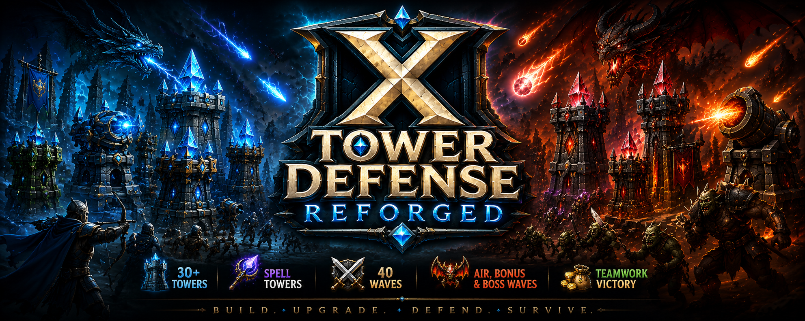

<p align="center">
  
</p>
<p align="center">


</p>

# X Tower Defense: Reforged

> A modern reimagining of the original **X Tower Defense**, created by
> **Karnaxus**.

## About

**X Tower Defense: Reforged (XTD:R)** is a complete rewrite of the
original X Tower Defense using a modular Lua architecture for Warcraft
III: Reforged.

This repository contains the **Lua source code** used to power the map.
It is provided so the Warcraft III modding community can learn from the
project's systems, architecture, and coding style.

**The playable map itself is protected and is not included in this
repository.**

------------------------------------------------------------------------

## Features

-   Modular Lua architecture
-   Data-driven tower registration
-   Generic spell tower system
-   Wave management
-   Results and statistics tracking
-   Player management
-   Command framework
-   Timer library
-   Message library
-   Quest system
-   Tower selling with tier-based refunds
-   Cooperative multiplayer support
-   Designed for Warcraft III: Reforged

------------------------------------------------------------------------

## Educational Purpose

This repository exists to help other Warcraft III developers learn
modern Lua scripting techniques.

Feel free to: - Read the code - Learn from the architecture - Reference
techniques and systems - Use ideas in your own projects

Please do **not** redistribute or deprotect the protected map.

------------------------------------------------------------------------

## Repository Structure

``` text
Init/
Constants/
Core/
Data/
Systems/
UI/
```

------------------------------------------------------------------------

## Contributing

Suggestions, bug reports, and constructive feedback are always welcome.

------------------------------------------------------------------------

## Credits

### Original X Tower Defense

Created by **Karnaxus** (circa 2005).

### X Tower Defense: Reforged

-   Karnaxus#11289
-   Darkdayze#1213

------------------------------------------------------------------------

## License

The Lua source code is shared for educational purposes.

You may study the code and learn from its implementation.

The protected Warcraft III map, imported assets, artwork, icons, music,
and other non-source content are not licensed for redistribution or
deprotection.

------------------------------------------------------------------------

## Thank You

If this repository helps you learn something new about Warcraft III Lua
development, then it has achieved its goal.

Happy modding!
